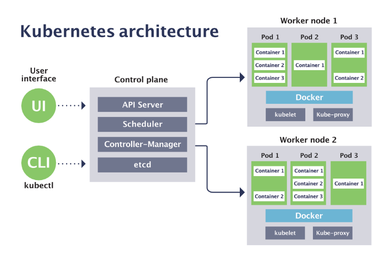

# Introduction to Kubernetes

## What is Kubernetes?
Kubernetes, often abbreviated as K8s, is an open-source container orchestration platform designed to automate the deployment, scaling, and management of containerized applications. Originally developed by Google, Kubernetes is now maintained by the Cloud Native Computing Foundation (CNCF).

## Key Features of Kubernetes
**Automated Rollouts and Rollbacks:** Manage updates to applications seamlessly.

**Service Discovery and Load Balancing**: Expose services to the internet or within the cluster and balance the load.
Storage Orchestration: Automatically mount the storage system of your choice.

**Self-healing:** Automatically restart containers that fail, replace, and reschedule them when nodes die.

**Secret and Configuration Management:** Deploy and update secrets and application configuration without rebuilding your image and without exposing secrets in your stack configuration.

## Kubernetes Architecture
Kubernetes follows a master-worker architecture. It includes several key components:

### Master Components
These components manage the Kubernetes cluster. They make global decisions about the cluster (like scheduling), as well as detecting and responding to cluster events (like starting up a new pod when a deployment’s replicas field is unsatisfied).

**1. kube-apiserver**
- Exposes the Kubernetes API.
- The front-end for the Kubernetes control plane.
- Scales horizontally by deploying multiple instances.

**2. etcd**
- Consistent and highly-available key-value store used as Kubernetes’ backing store for all cluster data.
- Stores configuration data that can be used by each of the nodes in the cluster.

**3. kube-scheduler**
- Watches for newly created pods with no assigned node and selects a node for them to run on.
- Factors taken into account include individual and collective resource requirements, hardware/software/policy constraints, affinity and
anti-affinity specifications, data locality, inter-workload interference, and deadlines.

**4. kube-controller-manager**
- Runs controller processes.
- Each controller is a separate process, but to reduce complexity, they are all compiled into a single binary and run in a single process.

**5. cloud-controller-manager**
- Runs controllers that interact with the underlying cloud providers.
- Allows the cloud provider’s code and the Kubernetes code to evolve independently.

### Node Components
These components run on every node, maintaining running pods and providing the Kubernetes runtime environment.

**1. kubelet**
- Ensures that containers are running in a Pod.
- Takes a set of PodSpecs provided (through various mechanisms) and ensures that the described containers are running and healthy.

**2. kube-proxy**
- Maintains network rules on nodes.
- These network rules allow network communication to your Pods from network sessions inside or outside of your cluster.

**3. Container Runtime**
- The software responsible for running containers.
- Examples include Docker, containerd, and CRI-O.

### Addons
Addons use Kubernetes resources (DaemonSet, Deployment, etc.) to implement cluster features. Some examples are:

**DNS:** All Kubernetes clusters should have cluster DNS; many examples are available.

**Web UI (Dashboard):** General-purpose web UI for managing cluster resources.

**Container Resource Monitoring:** Collects, aggregates, processes, and stores container metrics.

**Cluster-level Logging:** Mechanism to save container logs to a central log store with search/browsing interface.

## Summary
Kubernetes is a powerful orchestration tool that automates the deployment, scaling, and management of containerized applications. Understanding its architecture is crucial for effectively managing and utilizing a Kubernetes cluster. The master components handle the overall management and orchestration of the cluster, while the node components ensure that the actual applications run smoothly on the individual nodes.